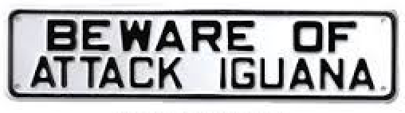

#Map 1 Assignment

**Scenario**:

The city of Melbourne, Australia has been invaded by a fleet of mutant alien (you guessed it!) iguanas!! World domination by our lizard overlords is at hand!

The invaders have established several landing zones across the city and created circular perimeters around these landing zones of various distances. The word on the street is that they're preparing to overtake the [Runaway Country Music Fest](http://www.runawaycountry.com/), which is held in Melbourne (March 20 - 22) and features such country superstars as Blake Shelton, Gunnar & The Grizzly Boys, and Clare Dunn. 

Aghast at the chance that these celebrities might not have a full audience for this festival the Lord Mayor of Melbourne, [Robert Doyle](http://en.wikipedia.org/wiki/Robert_Doyle) has hired you to make a map to help the Melbourne citizens make their way safely to the festival.

Through trial and error and the tragic loss of multiple undergraduates, it has been determined that the iguana aliens are capable of shooting their long, sticky tongues at least 2200 meters. 

Can YOU make a map that will allow users to avoid the fate of these poor university students?

**Map requirements**:

* Uses a basemap of your choice and centers/zooms the map appropriately.
* Map the provided data points, symbolized as circles in direct proportion to the size provided.
* Upon a user click, determines the distance from the click point to the perimeter of the circles.
* Is any circles are within 2200 meters of the click point, the color of the circle will change.

**Extra/alternative credit**:

Some extra and alternative challenges for those who take a different path.

* If a placemarker is within 2200 meters, implement a drag event to move it outside this distance. (five percentage points, out of 100)
* Rather than deleting every marker on the map when a user clicks a new location, only delete those that are within 2200 meters. (five percentage points, out of 100)

###Mapping Steps
You can solve this map in many ways but we really suggest that you do the following steps.  Note: anything **bolded** indicates that you need to use a certain approach, i.e., a loop, etc.  Test your code often and use console.log commands to check your code.

Use the index.html file provided and place your code at the spots indicated.

1. Add a set of base map tiles of your choosing. Note: you have to do this first before your map will work at all.

2. Center your map over Melbourne and at a zoom level of your choosing. You may need to change this once the circles are mapped. For your final map, you should make sure you can see all circles (you create below) when the map first loads.

3. Create two global variables that contains styles (also known as path options for circles). These will be used as a default style and an affordance style as in lab 09.  They should look significantly different so that a user can readily distinguish between them.

4. **Create a layer group** in which you will place circle objects.

5. Using a **loop** access data from the iguanaZones variable. Create circle objects (sized appropriately) and add them to your layer group.

6. Add your layer group to your map.

7. Add code (where indicated) to collect the location of a user click, create a Leaflet marker, and add it the map.

  * Once this works correctly uncomment the **additional code provided**. This removes an old marker once you click a new one and makes your map nicer.

8. Pass the location of the user click to the function testDistance (already provided).

9. Within the eachLayer method callback function (see comment for location of this step) test to see if the distance from the user click is more than 2200 meters from outer perimeter of each IguanaZone. Note: you will want to use the getRadius method on the circle objects you create.

10. If the user click is closer than 2200 meters apply the affordance style you made in step 3. If not, apply the default style.

11. Change the map title and metadata as per usual.

12. Replace the text that begins with "Lorem ipsum dolor..." with appropriate text. Remember the problem that this map is addressing and who hired you.
