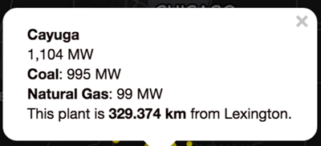
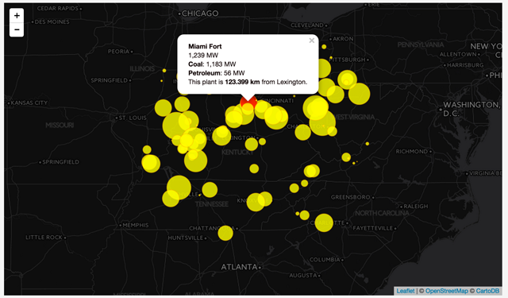
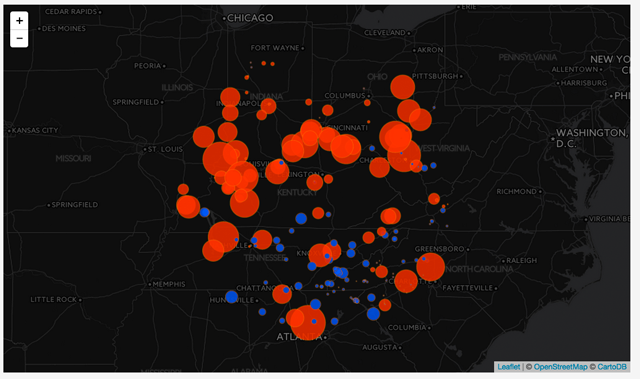
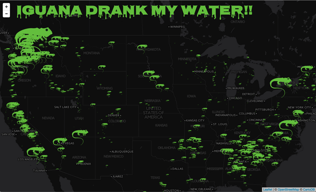

#Map Assignment 2

**Scenario**:

After the gods of mapping tried to destroy Lexington through snow in reaction to Map Assignment 1, the instructors of the course have decided to pursue the better part of valor and keep our scenarios simple. So here you go.

Some one came to you with power plant data and asked you to make a map. They specifically requested, no iguanas.

**Map requirements**:

You should use and adapt the code presented in Lab 11 to solve this map assignment. The goal is to create a proportional symbol map that: 

* shows power plants generated by one particular fuel source with less than 500 megawatts capacity;
* only shows plants within 400 km of a city of your choice; 
* uses `CircleMarker` symbols that reflect good cartographic practice (i.e., stacked proportional symbols with reduced opacity, scaled by area); and 
* provides each symbol the affordances of mouseover and mouseout.

###Mapping Steps (note: you can shift the order in which you do some of these steps).

1. Start with the bare bones index.html file provided with this file and add in what you need at the places indicated. Reference the previous map tasks and assignment templates for the needed HTML and JavaScript. 

2. Load in the dataset of power plants `power-plants-assignment.js` also contained within this directory. Do **NOT** use the dataset you used in the lab. Note: we’ve changed some of the property names in the file, so be sure to inspect the data with some `console.log()` commands so you know how to tweak the code from the lab.

3. Sort the power plant data from largest to smallest.

4. Use the `L.geoJson()` method (and other options,etc.) to add the power plant data to the map as `CircleMarkers`.  Be sure to use different options (color, weight, opacity etc.) for your map than were in the lab. Keep good cartographic practice in mind.

5. Create a function that adjusts the area of the `CircleMarker` based on power generation capacity of the plant's fuel source (as per good cartographic practice) and use this function to adjust the size of the `CircleMarkers` symbolizing power plants.

6. Add a `filter` option and write code within its function to select only those plants that are 1) powered by a fuel source of your choice and 2) have less than 500 megawatts of capacity with that particular fuel source (i.e., not total capacity) and 3) are within 400 km of the city of your choice.

7. Within an `onEachFeature` option, create mouseover and mouseout affordances that list the name of the plant in bolded text, the capacity of the plant, the capacity for each of its fuel sources, followed by the text "This plant is **XXX km** from YOURCITY'S NAME". Bold the distance and add appropriate HTML tags to create line breaks. Your popup should look like this (with the distance and name matching your map, of course):

    

    And the final map should look like this:

    

8. Make sure you have a map title, metadata and explanatory text as per usual. Remember the problem that this map is addressing and who hired you.

**Extra/alternative credit**:

* Same as above but show two different types of power plants and give each type a different fill color. Remember you want to size the plants only according to the amount of power being produced from that fuel source. Hint: consider how to modify the radius within the `onEachFeature` function. Your solution should look like this:

**Extra/Extra alternative credit**:

* Create a proportional symbol iguana map. It should look like this:

